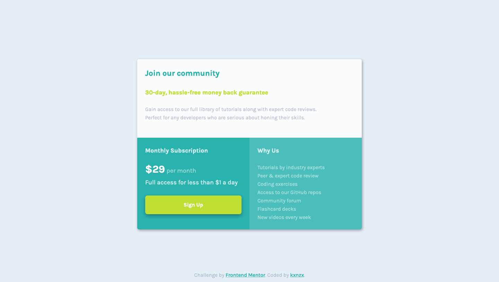

# Frontend Mentor - Single price grid component solution

This is a solution to the [Single price grid component challenge on Frontend Mentor](https://www.frontendmentor.io/challenges/single-price-grid-component-5ce41129d0ff452fec5abbbc). Frontend Mentor challenges help you improve your coding skills by building realistic projects.

## Table of contents

- [Overview](#overview)
  - [The challenge](#the-challenge)
  - [Screenshot](#screenshot)
  - [Links](#links)
- [My process](#my-process)
  - [Built with](#built-with)
  - [What I learned](#what-i-learned)
  - [Continued development](#continued-development)
- [Author](#author)

## Overview

### The challenge

Users should be able to:

- View the optimal layout for the component depending on their device's screen size
- See a hover state on desktop for the Sign Up call-to-action

### Screenshot



### Links

- [See Solution](https://www.frontendmentor.io/solutions/single-price-grid-with-flexbox-SY85ewaVE)
- [Live Site](https://kxnzx.github.io/single-price-grid/)

## My process

After a hiatus of more than half a year I finished the last components of this challenge. It was a bit of a hassle because I have forgotten quite a bit.

### Built with

- Semantic HTML5 markup
- CSS custom properties
- Flexbox
- Mobile-first workflow
- [Google Fonts](https://fonts.google.com/) - For fonts

### What I learned

With this challenge I had the opportunity to understand Flex-Box. Some notes for myself to remember:

- Make a distinction between `content` (fonts, colors etc.) and `lay-out` (grids, navbars etc.) and keep them seperate in css.

You can prepare some `lay-out's` with div-tags:

```
Div-tags are used as Flex- and Grid-containers for CSS.
```

- Understand the difference between `Flex-Container` and `Flex-Item`.

- The Flex-container only has impact on it's `direct children`; flex-items.

`Flex-Container Properties`:

```
- display (flex or grid)

- flex-direction (row or column)

- justify-content (horizontal; start, center, end etc.)

- align-items (vertical; start, center, end etc.)

These Properties are used together:
- flex-wrap (forcing flex-items onto multiple lines)
- align-content (distribution of space between and around items)
```

`Flex-Item Properties`

```
- align-self (to place each individual item at a certain spot on the cross axis)

- order (orden items)

- flex-grow (to distribute empty space onto item/items)

- flex-shrink (the opposite of grow)

- flex-basis (distribution of empty space)

```

### Continued development

Understanding of Grid.

## Author

- Frontend Mentor - [@kxnzx](https://www.frontendmentor.io/profile/kxnzx)
